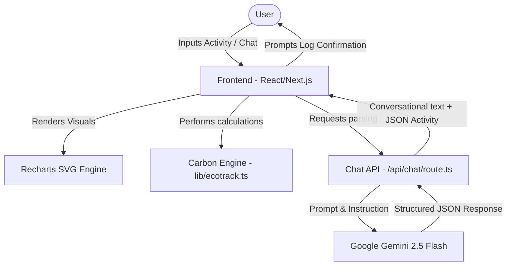

# EcoTrack AI – Personal Carbon Footprint Awareness Platform

[](https://github.com/Anshukr1123/EcoTrack/actions/workflows/test.yml)
[](https://ai.google.dev/)
[](https://cloud.google.com/run)
[](LICENSE)
[](https://www.typescriptlang.org/)
[](https://nextjs.org/)

**EcoTrack AI** is an AI-powered, gamified, and responsive sustainability platform designed to lower the barrier to tracking personal carbon footprints. Built on **Next.js**, **TypeScript**, and **Tailwind CSS**, the platform translates natural language descriptions of a user's day (powered by Google Gemini) into categorized, calculated carbon logs. 

Users can visualize their emissions, complete active eco-challenges, fund carbon offset initiatives using Eco Points, and generate official achievement certificates.

---

## 🚀 Live Demo & Deployment

* **Deployed App Link**: **[https://ecotrack-ai-36494818249.us-central1.run.app](https://ecotrack-ai-36494818249.us-central1.run.app)**
* **Repository Link**: **[https://github.com/Anshukr1123/EcoTrack](https://github.com/Anshukr1123/EcoTrack)**

---

## 1. Problem Statement & Solution

### The Problem
Many individuals want to adopt sustainable habits but lack the tools to measure their daily environmental impact. Existing carbon calculators are often overly technical, requiring manual, tedious input fields, which fails to keep users engaged.

### The Solution
EcoTrack AI provides:
* **Frictionless AI Inputs**: Users can simply type *"I biked 10 km and ate a vegan lunch"* to automatically log their footprint.
* **Gamified Incentives**: Earn Eco Points by engaging in positive environmental actions, which can be spent to fund verified carbon offset projects.
* **Actionable Projections**: Predictive analytics forecasting monthly and annual carbon emissions based on current behaviors.

---

## 2. System Architecture

The client-driven architecture performs standard calculations at the edge, utilizing a serverless handler to interact with Gemini safely:



---

## 3. Project Directory Structure

```
EcoTrack/
├── .github/
│   └── workflows/
│       └── test.yml          # GitHub Actions CI Configuration
├── app/
│   ├── api/
│   │   └── chat/
│   │       └── route.ts      # Serverless Chat API with input sanitation
│   ├── layout.tsx            # Global metadata and layout wrappers
│   └── page.tsx              # Main Next.js entrypoint
├── components/
│   ├── activity-form.tsx     # Categories tabbed form with live preview
│   ├── ai-coach.tsx          # Chat wrapper communicating with Gemini Coach
│   ├── carbon-chart.tsx      # Recharts (Bar/Pie Toggle) display
│   ├── dashboard.tsx         # Main Orchestrator state controller
│   ├── leaderboard-panel.tsx # Comparative social ranking grids
│   ├── challenges-panel.tsx  # Gamified checklists for Eco Points
│   ├── offsets-panel.tsx     # Points spending for verified tree/solar offsets
│   └── badges-panel.tsx      # Achievements list and SVG Modal previewer
├── docs/                     # Comprehensive Developer Guides
│   ├── architecture.md       # Deeper dive into system designs
│   ├── api.md                # Chat request/response schemas
│   ├── testing.md            # Testing methods and coverages
│   └── deployment.md         # Detailed Cloud Run configuration guides
├── lib/
│   └── ecotrack.ts           # Greenhouse constants and calculations
├── test.ts                   # Core Engine & API validation runner
├── package.json              # NPM Dependencies and scripts
└── next.config.mjs           # Next.js standalone container configs
```

---

## 4. How the Solution Works (AI Workflow)

1. **Activity Parsing**: When a user inputs natural text (e.g. *"recycled 12 kg of trash"*), the AI Coach route parses the prompt utilizing **Google Gemini** in JSON schema mode.
2. **Structured JSON Extraction**: The endpoint sanitizes inputs and extracts matching structures:
   ```json
   {
     "text": "Great job! Recycling saves materials from landfills.",
     "activity": {
       "type": "waste_recycled",
       "amount": 12
     }
   }
   ```
3. **One-Click Logging**: The UI intercepts the JSON block and renders a dedicated card inside the chat: **Recycled Waste: 12 kg. [Log Activity]**. Clicking the button logs it to the dashboard.
4. **Calculations**: Total carbon footprint recalculates using greenhouse factors in `lib/ecotrack.ts` (e.g. `waste_recycled = 0.05 kg CO2/kg` and awards `8 pts/kg`).
5. **Offsets**: Users spend accumulated Eco Points (e.g. 150 points for *Plant a Native Tree*) which records a negative carbon entry (`co2Offset = -10 kg`), reducing their net footprint.
6. **Certification**: Reaching **500 Eco Points** unlocks a downloadable SVG Achievement Certificate containing the user's nickname.

---

## 5. Prerequisites & Local Installation

### Prerequisites
* **Node.js 18+**
* **NPM**

### Setup
1. Clone the repository:
   ```bash
   git clone https://github.com/Anshukr1123/EcoTrack.git
   cd EcoTrack
   ```
2. Install dependencies:
   ```bash
   npm install
   ```

### Environment Variables
Create a `.env` file in the root directory:
```env
GEMINI_API_KEY=your_gemini_api_key_here
```
*Note: `.env` is omitted from Git by default via `.gitignore` to avoid exposing secrets.*

---

## 6. Running and Verifying

### Development Server
Run the local dev server:
```bash
npm run dev
```
Open **http://localhost:3000** in your browser.

### Linting & Quality Audits
Verify TypeScript types and ESLint configs:
```bash
npm run lint
```

### Running Tests
Execute the automated test suite locally:
```bash
npm test
```

---

## 7. Deployment to Google Cloud Run

To build and deploy the containerized application to Google Cloud Run:

```bash
gcloud run deploy ecotrack-ai \
  --source . \
  --project adept-sentinel-495106-u2 \
  --region us-central1 \
  --allow-unauthenticated \
  --memory=1Gi \
  --set-env-vars GEMINI_API_KEY=YOUR_GEMINI_API_KEY
```

---

## 8. Future Scope

* **Integration with smart meters**: Connect utility electricity inputs directly to home smart meters.
* **Barcode Scanners**: Scan food items to automatically extract ingredients and calculate custom dietary footprints.
* **Global Offsets**: Partner with verified global standard registry registries (Gold Standard, Verra) to allow users to purchase real-world certified offsets.

---

## 9. License

Distributed under the MIT License. See [LICENSE](LICENSE) for details.