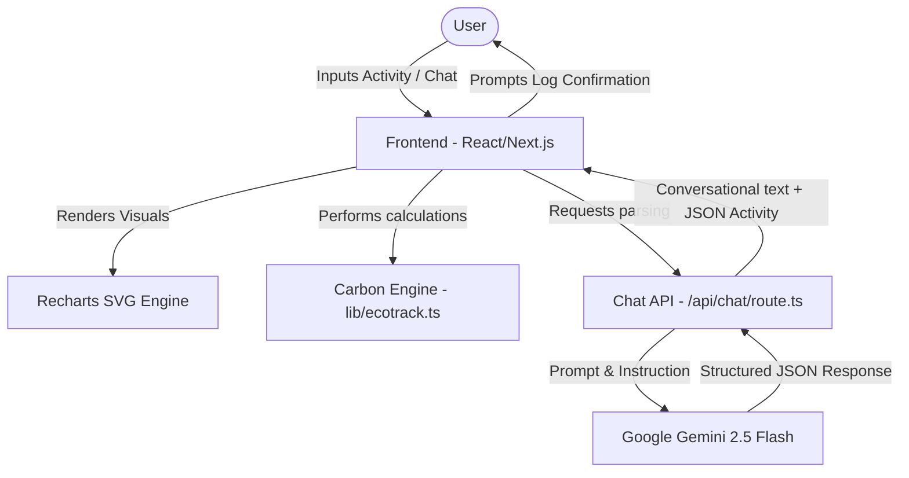

# System Architecture & Design

This document details the system design, file layout, and data flow of **EcoTrack AI**.

---

## 1. System Components Diagram

The core architecture follows a client-driven model with a serverless API boundary to communicate safely with Google Gemini:

## 2. Component Directory Structure

The codebase is organized into modules conforming to clean-architecture principles:

* **`app/`**: Next.js App Router root.
  * **`api/chat/route.ts`**: API route parsing natural language queries via Gemini and returning structured activities.
  * **`layout.tsx`**: Page wrapping with search optimization meta-tags.
  * **`page.tsx`**: Entry view, mounting the main dashboard.
* **`components/`**: Reusable modular UI elements.
  * **`dashboard.tsx`**: Main dashboard view. Composes sub-panels, handles local storage syncing, and tracks global states.
  * **`activity-form.tsx`**: Clean, categorized form interface for logging transport, utilities, dietary choice, waste, and shopping emissions.
  * **`ai-coach.tsx`**: Interactive chat interface connecting users to the EcoCoach.
  * **`carbon-chart.tsx`**: Dynamic statistics visualization powered by Recharts (Bar/Pie toggles).
  * **`leaderboard-panel.tsx`**: Display rankings across Friends, College, or City networks.
  * **`challenges-panel.tsx`**: Interactive checks for gamified active eco-challenges.
  * **`offsets-panel.tsx`**: Buy verified offsets (tree planting, solar panels) using Eco Points.
  * **`badges-panel.tsx`**: Renders achievements, unlocks, and generates certificate PDFs.
* **`lib/`**: Business logic.
  * **`ecotrack.ts`**: Holds carbon calculation conversion factor constants, point multipliers, projection algorithms, and high-entropy ID helpers.
* **`test.ts`**: Command-line verification runner test suite.

## 3. Data Flow & State Management

All state is managed at the top-level `Dashboard` component and backed up locally to `localStorage`:
1. **Activity Addition**: Adding an activity calculates emissions and awards/deducts points using coefficients in `lib/ecotrack.ts`. The new entry is prepended to the activities list.
2. **Local Storage Synchronization**: Any state mutations automatically trigger serializations to local storage, keeping data persisted on refresh.
3. **Offset Purchasing**: Spending points inserts a pseudo-activity log with negative emissions (`co2 < 0`) and negative point adjustments (`pointsEarned < 0`).
4. **Calculations**: Total gross emissions, offsets, net footprints, point balances, projections, and unlocked badges recalculate dynamically on state updates.
